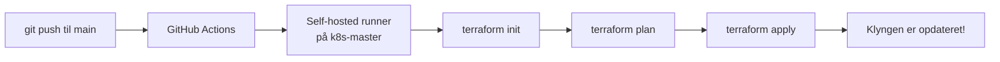

# GitHub Actions Self-Hosted Runner – Opsætningsguide

> Denne guide beskriver hvordan du sætter GitHub Actions op, så din **k8s-master** node automatisk henter de nyeste ændringer og kører `terraform apply` når du pusher til `main`.

## Arkitektur

```
Du (lokal PC)                     GitHub                        k8s-master
     │                               │                              │
     │  git push til main ──────────►│                              │
     │                               │  trigger workflow ──────────►│
     │                               │                              │
     │                               │     1. git checkout          │
     │                               │     2. terraform init        │
     │                               │     3. terraform plan        │
     │                               │     4. terraform apply       │
     │                               │                              │
     │                               │◄──── resultater rapporteres  │
```

---

## Forudsætninger

- [x] GitHub repository oprettet med dine Terraform-filer
- [ ] SSH-adgang til **k8s-master** (`10.200.0.11`)
- [ ] Terraform installeret på **k8s-master**
- [ ] `kubectl` + kubeconfig konfigureret på **k8s-master**
- [ ] Helm installeret på **k8s-master**

---

## Step 1: Installér Terraform på k8s-master

SSH ind på din master node:

```bash
ssh bruger@10.200.0.11
```

Installér Terraform:

```bash
# Tilføj HashiCorp GPG nøgle
wget -O- https://apt.releases.hashicorp.com/gpg | sudo gpg --dearmor -o /usr/share/keyrings/hashicorp-archive-keyring.gpg

# Tilføj HashiCorp repository
echo "deb [signed-by=/usr/share/keyrings/hashicorp-archive-keyring.gpg] https://apt.releases.hashicorp.com $(lsb_release -cs) main" | sudo tee /etc/apt/sources.list.d/hashicorp.list

# Installér
sudo apt update && sudo apt install terraform -y

# Verificér
terraform --version
```

---

## Step 2: Installér GitHub Actions Self-Hosted Runner

En **self-hosted runner** er en process der kører på din k8s-master og lytter efter jobs fra GitHub.

### 2.1 Opret runner i GitHub

1. Gå til dit repository på GitHub
2. Klik på **Settings** → **Actions** → **Runners**
3. Klik **New self-hosted runner**
4. Vælg **Linux** og **x64** (eller **ARM64** hvis relevant)

### 2.2 Installér runner på k8s-master

SSH ind på k8s-master og kør kommandoerne fra GitHub-siden:

```bash
# Opret en mappe til runneren
mkdir -p ~/actions-runner && cd ~/actions-runner

# Download seneste runner (erstat URL med den GitHub viser dig)
curl -o actions-runner-linux-x64-2.321.0.tar.gz -L https://github.com/actions/runner/releases/download/v2.321.0/actions-runner-linux-x64-2.321.0.tar.gz

# Udpak
tar xzf ./actions-runner-linux-x64-2.321.0.tar.gz
```

### 2.3 Konfigurér runner

```bash
# Konfigurér med dit repository (erstat TOKEN med token fra GitHub)
./config.sh --url https://github.com/DIT-BRUGERNAVN/k8s-office --token DIT_TOKEN
```

Du bliver spurgt om:
- **Runner group**: Tryk Enter (default)
- **Runner name**: f.eks. `k8s-master`
- **Labels**: Tryk Enter (default: `self-hosted,Linux,X64`)
- **Work folder**: Tryk Enter (default: `_work`)

### 2.4 Installér som systemd service (kører automatisk ved boot)

```bash
# Installér service
sudo ./svc.sh install

# Start service
sudo ./svc.sh start

# Tjek status
sudo ./svc.sh status
```

> [!IMPORTANT]
> Runneren skal køre som en bruger der har adgang til `kubectl` og `kubeconfig`. Hvis du kører som root, skal kubeconfig ligge i `/root/.kube/config`.

### 2.5 Verificér i GitHub

Gå tilbage til **Settings** → **Actions** → **Runners** i dit repository. Du bør se din runner med status **Idle** (grøn).

---

## Step 3: Konfigurér kubeconfig for runneren

Runneren skal have adgang til Kubernetes-klyngen. Sørg for at kubeconfig er tilgængelig for den bruger der kører runneren:

```bash
# Tjek hvilken bruger runneren kører som
sudo systemctl show actions.runner.* | grep User=

# Kopiér kubeconfig til den bruger (hvis nødvendigt)
sudo cp /etc/kubernetes/admin.conf /home/RUNNER_BRUGER/.kube/config
sudo chown RUNNER_BRUGER:RUNNER_BRUGER /home/RUNNER_BRUGER/.kube/config
```

Test at kubectl virker som runner-brugeren:

```bash
sudo -u RUNNER_BRUGER kubectl get nodes
```

---

## Step 4: GitHub Actions Workflow

Du har allerede en workflow-fil i `.github/workflows/deploy.yml`. Sådan virker den:

```yaml
name: Deploy K8s Infrastructure

on:
  push:
    branches: [main]          # Trigger kun på push til main
    paths:
      - '*.tf'                # Kun ved ændringer i Terraform-filer
      - 'terraform.tfvars'    # Eller terraform.tfvars
      - '.github/workflows/deploy.yml'

jobs:
  deploy:
    name: Terraform Apply
    runs-on: self-hosted      # ← Kører på din k8s-master!

    steps:
      - name: Checkout repository
        uses: actions/checkout@v4    # Henter seneste kode fra GitHub

      - name: Terraform Init
        run: terraform init

      - name: Terraform Validate
        run: terraform validate

      - name: Terraform Plan
        run: terraform plan -out=tfplan

      - name: Terraform Apply
        run: terraform apply -auto-approve tfplan

      - name: Show Outputs
        run: terraform output
```

### Hvad sker der trin for trin?

| Trin | Hvad sker der |
|------|---------------|
| `on: push` | Workflow starter når du pusher til `main` |
| `runs-on: self-hosted` | Jobbet kører på din k8s-master (ikke GitHub's servere) |
| `actions/checkout@v4` | Henter den nyeste kode fra dit repository |
| `terraform init` | Initialiserer Terraform providers |
| `terraform validate` | Validerer at dine .tf filer er korrekte |
| `terraform plan` | Viser hvad Terraform vil ændre |
| `terraform apply` | Anvender ændringerne på din klynge |

---

## Step 5: Test det hele

### 5.1 Lav en ændring lokalt

```bash
# Ændr noget i terraform.tfvars, f.eks. tilføj en applikation
code terraform.tfvars
```

### 5.2 Push til GitHub

```bash
git add .
git commit -m "Test: GitHub Actions deploy"
git push origin main
```

### 5.3 Tjek workflow-status

1. Gå til dit repository på GitHub
2. Klik på **Actions** fanen
3. Du bør se dit workflow køre
4. Klik på det for at se logs i realtid

---

## Step 6: Fejlfinding

### Runner vises ikke som "Idle"

```bash
# Tjek service status
sudo ./svc.sh status

# Se logs
journalctl -u actions.runner.* -f
```

### Terraform fejler med "permission denied"

```bash
# Sørg for at runner-brugeren har adgang til kubeconfig
sudo -u RUNNER_BRUGER kubectl get nodes
```

### Workflow trigger ikke

Tjek at:
1. Du pusher til `main` branchen (ikke en anden branch)
2. Du ændrer en `.tf` fil eller `terraform.tfvars` (andre filer trigger ikke)
3. Runner er online (grøn i GitHub Settings → Runners)

### Terraform state conflicts

```bash
# Hvis du får "state lock" fejl, kan du force-unlock
terraform force-unlock LOCK_ID
```

---

## Opsummering



Denne opsætning giver dig:
- **Automatisk deployment** ved push til main
- **Fuld kontrol** – alt kører på din egen hardware
- **Git som source of truth** – alle ændringer er sporbare
- **Terraform plan** ved hver deploy – du kan se ændringerne i GitHub Actions logs
